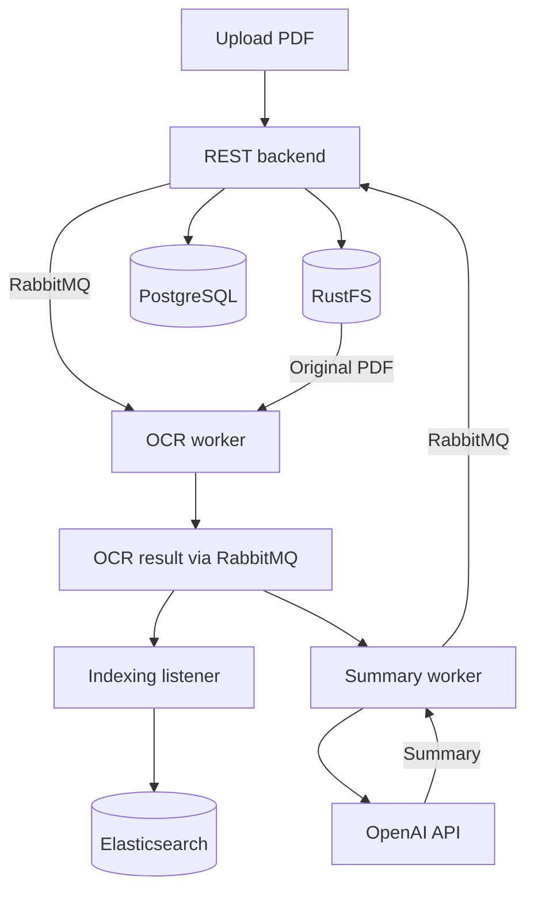

# SWEN3 Document Management System

Software Engineering 3 Labor, WS 2026, Group G

Yann Polini and Simon Stangelberger

[Repository](https://github.com/SimSta123/SWEN-3-Document-Management-System) · [Kanban board](https://github.com/users/YannPolini/projects/4) · [Milestones](https://github.com/SimSta123/SWEN-3-Document-Management-System/milestones)

Paperless is our document management system for SWEN3. We upload PDFs, organise them into projects and search their contents. The app reads each PDF with OCR and automatically generates an AI summary. We can also generate one summary for an entire project.

## Run the project

You need Docker Desktop with Linux containers enabled.

1. Copy `.env.example` to `.env`.
2. Set the database and RabbitMQ passwords, the RustFS access keys, `ELASTIC_PASSWORD`, `KIBANA_PASSWORD` and `OPENAI_API_KEY`. Keep the key in your local `.env`.
3. Start the app from the project folder.

   ```sh
   docker compose up --build --detach --wait
   ```

4. Open [localhost](http://localhost/) for the website.

The first build takes a while because it downloads the images and builds the Java applications. The `kibana-setup` container should finish and exit successfully. It only sets up Kibana's service account; the other services keep running.

| Service | Default address | Login |
| --- | --- | --- |
| Website | http://localhost/ | None |
| Backend API | http://localhost:8081 | None |
| RabbitMQ management | http://localhost:15672 | `paperless` / `RABBITMQ_PASSWORD` |
| RustFS console | http://localhost:9001 | RustFS access keys |
| Elasticsearch | http://localhost:9200 | `elastic` / `ELASTIC_PASSWORD` |
| Kibana | http://localhost:5601 | `elastic` / `ELASTIC_PASSWORD` |
| Logstash JSON input | http://localhost:18080 | None |

Passwords and keys come from your `.env`. `KIBANA_PASSWORD` is for the internal `kibana_system` account, not the Kibana website login. RustFS uses port 9000 for its S3 API.

You can change the website, backend and Elastic ports with `WEB_PORT`, `API_PORT`, `ELASTICSEARCH_PORT`, `KIBANA_PORT` and `LOGSTASH_PORT`. PostgreSQL is only reachable inside Docker. Published service ports are bound to localhost. Elasticsearch uses HTTP with password authentication for this local setup.

Run `docker compose down` to stop the project. This keeps the stored data in Docker volumes. Keep `.env` out of Git. Changing `POSTGRES_PASSWORD` in the file does not change the password in an existing database volume.

## How it works

The website uses HTML, CSS and JavaScript, served by nginx. The backend uses Java 25, Spring Boot and Maven. PostgreSQL stores document metadata, projects and summaries. We use RustFS for the PDF files.


```mermaid
flowchart TD
    Upload["Upload PDF"] --> Backend["REST backend"]
    Backend --> Files[("RustFS")]
    Backend -->|RabbitMQ| OCR["OCR worker"]
    Files -->|Original PDF| OCR
    OCR --> Text["OCR result via RabbitMQ"]
    Text --> Index["Indexing listener"] --> Search[("Elasticsearch")]
    Text --> Summaries["Summary worker"] --> OpenAI["OpenAI API"]
    OpenAI -->|Summary| Summaries
    Summaries -->|RabbitMQ| Backend
    Backend --> Database[("PostgreSQL")]
```

When we upload a PDF, the backend saves the file in RustFS and its metadata in PostgreSQL, then queues the upload in RabbitMQ. The OCR worker downloads the PDF and reads it with Tesseract. RabbitMQ sends the extracted text to both the indexing listener and the summary worker. One makes the text searchable in Elasticsearch. The other calls OpenAI and sends the result back to the backend, which saves the summary in PostgreSQL.

In the backend, controllers handle HTTP requests, services handle the logic and repositories access the database. Spring injects these dependencies through constructors. MapStruct converts database entities into API response records. Flyway creates the tables, and Hibernate checks them against the entities. nginx forwards `/api/` requests to the backend and removes that prefix.

## Website and API

The website opens the document library. New uploads land in **Unassigned**. Use the move button on a row or drag the document onto a folder in the sidebar. A document belongs to one project at a time.

Open a document to read its summary or click **Open PDF** to view and download the original in your browser. Open a project and click **Generate** or **Regenerate** to summarise its documents. The project icon opens the emoji picker. Your choice is stored in your browser.

Search looks through the OCR text in Elasticsearch and shows the matching documents. A new upload becomes searchable after the worker finishes processing it. Deleting a project leaves its documents unassigned. Deleting a document removes its database record, PDF and search entry. Queued or running OCR jobs cannot bring a successfully deleted document back.

The table below uses the backend paths. When calling through nginx, add `/api`, for example `/api/documents`.

| Method | Endpoint | Action |
| --- | --- | --- |
| POST | `/projects` | Create a project |
| GET | `/projects` | List projects |
| POST | `/projects/{projectId}/summary` | Start generating a project summary |
| GET | `/projects/{projectId}/summary` | Read the project summary and its status |
| DELETE | `/projects/{projectId}` | Delete a project and leave its documents unassigned |
| POST | `/documents` | Create a record from JSON or upload a multipart PDF |
| GET | `/documents` | List all documents |
| GET | `/documents?search=Hello` | Find documents whose OCR text matches the search |
| GET | `/documents/{documentId}` | Read a document |
| GET | `/documents/{documentId}/pdf` | Open the original PDF |
| DELETE | `/documents/{documentId}` | Delete a document, its PDF and its search entry |
| DELETE | `/documents/{documentId}/project` | Move a document to Unassigned |
| PUT | `/projects/{projectId}/documents/{documentId}` | Assign or move a document |
| GET | `/projects/{projectId}/documents` | List a project's documents |

See [project and document requests](requests/projects.http) and [health requests](requests/health.http) for examples.

### Upload a PDF

Use the website's PDF upload form, or send a multipart request with a `file` field. The API also accepts an optional `title`; otherwise it uses the filename.

```sh
curl --fail-with-body -F "file=@/path/to/notes.pdf;type=application/pdf" -F "title=Course notes" http://localhost/api/documents
docker compose logs --since 1m ocr-worker
```

On Windows, use `curl.exe` and replace the path with your PDF's path. The response should be 201 with the new document ID. After processing, the worker logs `OCR completed: documentId=<id>`.

Uploads are limited to 10 MiB. The REST endpoint rejects empty files and files without a `%PDF-` header. It only checks the header; the worker parses the PDF later. Creating a record from a JSON title still works, but that record has no PDF to process.

## OCR and indexing

The upload queue is `document.uploaded`. A stored PDF produces a message like `Document created: 42 with key: <objectKey>`. The worker uses the key to fetch the PDF from the same `documents` bucket as the backend.

[PdfOcr](ocr-worker/src/main/java/at/technikum/swen3/worker/PdfOcr.java) renders every page at 300 DPI and runs Tesseract with English language data. Tesseract is installed in the worker image, so it does not need to be installed on the host. Temporary PDFs and page images are removed after processing. Each page has a 60-second timeout.

The OCR result goes to `document.ocr.completed` as persistent JSON:

```json
{"documentId":42,"text":"Hello World"}
```

[IndexingListener](ocr-worker/src/main/java/at/technikum/swen3/worker/IndexingListener.java) checks the result and passes it to [ElasticsearchIndexer](ocr-worker/src/main/java/at/technikum/swen3/worker/ElasticsearchIndexer.java). The `documents` index stores `documentId` as `long` and the extracted `text` as searchable text. Its Elasticsearch ID matches the document ID in PostgreSQL. Processing the same result again replaces the entry instead of creating a duplicate.

The indexer creates the index if needed and writes with `refresh=wait_for`. It acknowledges the result message after Elasticsearch accepts the entry and makes it visible to search. The search API can use the stored `documentId` to look up the document's title and metadata.

`OCR_QUEUE`, `OCR_RESULT_QUEUE` and `ELASTICSEARCH_INDEX` change the default queue and index names. The worker also supports `TESSERACT_COMMAND`, `OCR_LANGUAGE` and `OCR_PAGE_TIMEOUT` in its environment. Other OCR languages need their trained data installed in the image.

### Deleting a document during processing

The worker checks that the document still exists before downloading its PDF and after OCR. Deletion and indexing also lock the same PostgreSQL record. If indexing finishes first, deletion removes its result. If deletion finishes first, the worker skips the old result. Upload messages only become available after the new database record commits.

The database, RustFS and Elasticsearch do not share one transaction. If deletion fails partway through, some external data may already be gone; the request returns an error and deletion can be retried. Failed worker messages stay in the failed queues for manual inspection.

### Failed messages

Both RabbitMQ queues are durable. Failed upload processing goes to `document.uploaded.failed`; invalid OCR results and indexing failures go to `document.ocr.completed.failed`. These queues have no consumer, so we can inspect or manually retry the messages instead of retrying a bad message forever. Changing a queue name also changes its failed queue to that name plus `.failed`.

Blank or invalid UTF-8 upload messages are rejected. Older metadata-only messages and the text/JSON test messages are still logged, but do not start OCR because they have no storage key. Spring acknowledges messages after successful processing and reconnects if RabbitMQ goes offline.

An older local queue may exist without the failed-message settings. RabbitMQ will reject the new arguments for that queue. Drain its pending messages before recreating it, or use a new queue name for testing. Do not delete queued uploads or OCR results.

Use `docker compose logs -f ocr-worker` for worker logs and the RabbitMQ management page to inspect queues.

## Summary worker

Each PDF is summarised automatically after OCR. Use the refresh button on the document page to check for the saved result. The website currently has no manual retry for a single document.

A project summary is generated on request and uses the saved document summaries. If documents are still processing, the project waits for them. If there are no usable summaries, add a readable PDF and retry.

The summary worker logs the start, result or failure category with the document ID. Failed document jobs go to `document.genai.requested.failed`, and the worker can continue with the next document.

```sh
docker compose logs summary-worker
```

## RustFS and ELK

Compose starts RustFS, the worker, Elasticsearch, Logstash and Kibana alongside the database, RabbitMQ, backend and frontend. The backend and worker wait for RustFS readiness. The worker and Logstash wait for Elasticsearch, and Kibana waits for its account setup to finish.

Elasticsearch, Logstash and Kibana all use version 9.5.6. Their stored data uses Docker volumes. Elasticsearch runs as a single node.

The [Logstash pipeline](docker/elk/logstash.conf) accepts JSON over HTTP, keeps a persistent queue and writes events to `paperless-logs-*` in Elasticsearch. Kibana connects to Elasticsearch so we can inspect the data. This is a simple ELK connection setup; it does not collect every application's logs automatically. OCR text is stored separately in `documents`.

## Validation and API errors

The website accepts PDF uploads and checks project names. The API and service validate document titles, project names and IDs, including calls made directly to the service.

[ApiExceptionHandler](backend/src/main/java/at/technikum/swen3/paperless/controller/ApiExceptionHandler.java) returns JSON problem responses: 400 for invalid input, 404 for missing records, 409 for database conflicts and 503 for temporary database failures. Other failures return 500. Full errors stay in the logs; responses do not include SQL or connection details.

The request filter logs HTTP requests. Services log their operations and rejected inputs. Service DEBUG logging is configured in [application.properties](backend/src/main/resources/application.properties).

## Tests and checks

Backend unit tests use JUnit and Mockito for service logic. HTTP integration tests run against H2 with RabbitMQ mocked. We check PostgreSQL, RabbitMQ, RustFS and Elasticsearch separately in the running Compose stack.

The Docker builds run the Java tests. With JDK 25 and Maven installed, you can run `mvn verify` in `backend/`, `ocr-worker/` or `summary-worker/`. The backend also includes a Maven wrapper. Backend coverage is written to `backend/target/site/jacoco/index.html`.

The OCR tests cover a two-page image-only PDF, message validation, Elasticsearch requests and deletion/indexing races. The summary worker tests cover blank OCR text and API failures. [GitHub CI](.github/workflows/ci.yml) runs the backend tests and checks the Compose stack.

| Script | What it checks |
| --- | --- |
| `python scripts/check-ocr-worker.py` | Message logs, acknowledgements and failed-message routing |
| `python scripts/check-ocr-flow.py` | PDF upload, RustFS retrieval, OCR, Elasticsearch search, repeated delivery and invalid results |
| `python scripts/check-elk.py` | Kibana availability and a Logstash event arriving in Elasticsearch |
| `python scripts/check-deletion-flow.py` | Deletion from all three stores, queued jobs, redelivery and OCR finishing after deletion |

Use a disposable test stack. These scripts create test data and read failed messages; the deletion check also temporarily stops and restarts that stack's worker. Set `RABBITMQ_PASSWORD` and `ELASTIC_PASSWORD` in your shell to match that stack. The deletion check also needs `RUSTFS_ACCESS_KEY` and `RUSTFS_SECRET_KEY`. The OCR and deletion flow checks use `API_URL`, defaulting to `http://localhost:8081`; CI sets it to the nginx API address.

The checks support `RABBITMQ_MANAGEMENT_URL`, `ELASTICSEARCH_URL`, `ELASTICSEARCH_INDEX`, `KIBANA_URL` and `LOGSTASH_URL` for other addresses. They also accept `ELASTICSEARCH_PASSWORD` in place of `ELASTIC_PASSWORD`. The worker checks use the configured queue names. The Elasticsearch checks wait through temporary 404/503 responses while the first index shards start, then fail if the data does not appear in time.

For a quick Sprint 5 check, upload a readable PDF and open its detail page. Wait for OCR and refresh the page to see the saved summary. Search for a word from the PDF and use **Open PDF** to check the original. Then move it into a project and click **Generate** on the project page.

## Code and references

- [Backend](backend/src/main/java/at/technikum/swen3/paperless): controllers, services, entities and repositories
- [Database migrations](backend/src/main/resources/db/migration)
- [Frontend](frontend/public)
- [OCR worker](ocr-worker/src/main/java/at/technikum/swen3/worker)
- [Summary worker](summary-worker/src/main/java/at/technikum/swen3/summary)
- [Docker Compose setup](compose.yaml)
- [Spring AMQP listeners](https://docs.spring.io/spring-amqp/reference/amqp/receiving-messages/async-annotation-driven.html) and [error handling](https://docs.spring.io/spring-amqp/reference/amqp/exception-handling.html)
- [Elasticsearch index API](https://www.elastic.co/docs/api/doc/elasticsearch/operation/operation-index) and [Docker setup](https://www.elastic.co/docs/deploy-manage/deploy/self-managed/install-elasticsearch-docker-basic)
- [Kibana Docker setup](https://www.elastic.co/docs/deploy-manage/deploy/self-managed/install-kibana-with-docker) and [Logstash configuration](https://www.elastic.co/docs/reference/logstash/docker-config)

One problem we ran into was nginx forwarding the wrong path. Removing `/api/` fixed it. We also added validation in the service because frontend and controller checks do not cover direct service calls. For Sprint 4, we had to account for Elasticsearch taking a moment to make a new index searchable, so the checks wait for it within a time limit.

We work on sprint branches and check the whole app before merging into `main`. Tasks are on the board linked above. We used Codex to help with implementation, tests and documentation, and both go through the code before the review.
